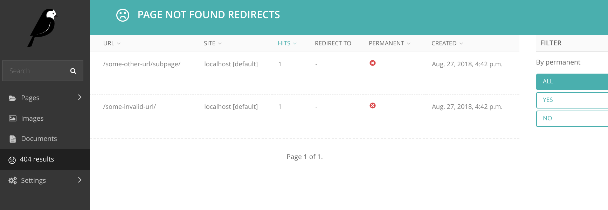
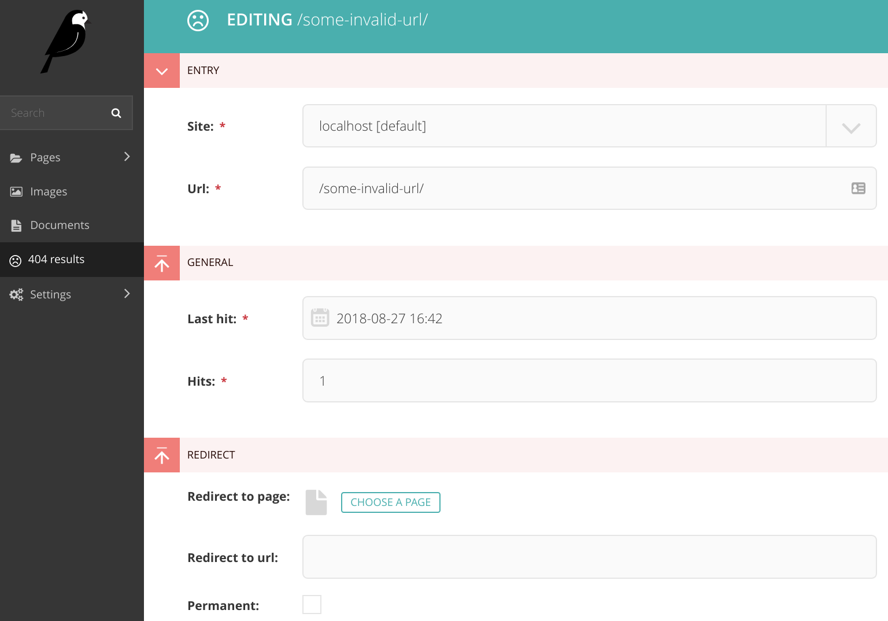

=====
Usage
=====

To use wagtail_managed404 in a project, simply add it to the INSTALLED_APPS::

    INSTALLED_APPS = [
        ...

        'wagtail.contrib.modeladmin',
        'wagtailfontawesome',
        'wagtail_managed404',

*wagtailfontawesome* is required to render the admin icon. *wagtail.contrib.modeladmin* is used for the admin panel
itself.

And make sure to use the supplied middleware::

    MIDDLEWARE = [
        ...

        'wagtail_managed404.middleware.PageNotFoundRedirectMiddleware',
    ]

Run the migrations::

    ./manage.py migrate

Now, the system should automatically track 404 responses. These will show up in the admin:

And they can be edited to supply a redirect for future requests:

Entries in this list will be added automatically, but this behavior can be customized with the following setting::

    # default
    IGNORED_404S = [
        r'^/static/',
        r'^/favicon.ico'
    ]
